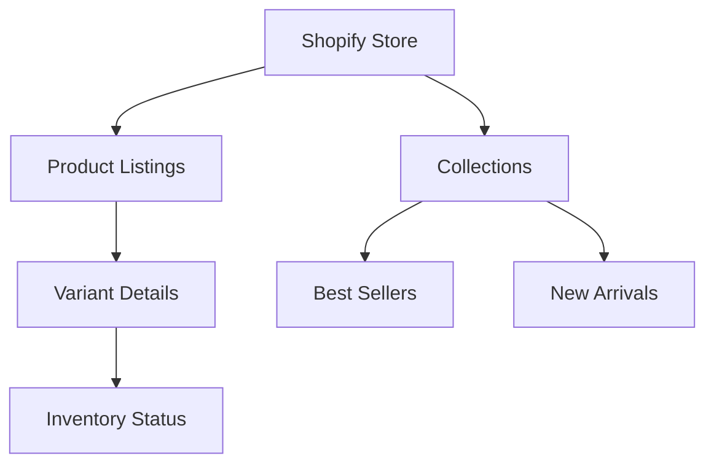

# Pepper Product Analysis

## Data Sources
- Koala Inspector exports (Jan 17, 2025)
- Shopify store analysis
- Amazon marketplace data

## Product Structure Analysis

### SKU Pattern Analysis
```python
# Example SKU Patterns
BRA035BU32AA  # Zero-G Wirefree
SAY01BL32A    # Signature All You
LUB01SD34AA   # Lift Up Bra
```

### Size Matrix
| Band Size | Cup Sizes |
|-----------|-----------|
| 30-42     | AA, A, B  |

### Price Points
| Product Line        | Price (USD) |
|--------------------|-------------|
| Zero-G Wirefree    | $65.00     |
| Signature All You  | $60.00     |
| Lift Up Bra        | $65.00     |

## Data Collection Strategy

### 1. Product Data Pipeline


### 2. Quality Checks
- [ ] SKU pattern validation
- [ ] Price consistency checks
- [ ] Size availability matrix
- [ ] Image URL validation
- [ ] Inventory tracking

### 3. Metadata Collection
- Materials composition
- Manufacturing locations
- Certifications
- Product descriptions
- Size recommendations

## Analysis Plan

### Phase 1: Data Structure
1. Create unified product schema
2. Build variant relationship model
3. Map collection hierarchies

### Phase 2: Business Analysis
1. Price point analysis
2. Size distribution patterns
3. Inventory management insights
4. Collection strategy review

### Phase 3: Technical Implementation
1. Update scraper configuration
2. Implement data validation
3. Create automated reports
4. Build monitoring dashboard

## Next Steps

1. **Immediate Actions**
   - [ ] Update scraper config with SKU patterns
   - [ ] Create size validation matrix
   - [ ] Implement price consistency checks

2. **Development Tasks**
   - [ ] Build product schema validator
   - [ ] Create inventory tracking system
   - [ ] Develop collection analyzer

3. **Analysis Goals**
   - [ ] Size distribution report
   - [ ] Price point comparison
   - [ ] Collection performance metrics

## Questions to Answer

1. **Product Strategy**
   - How are products organized across collections?
   - What is the pricing strategy per category?
   - How are variants managed across platforms?

2. **Inventory Management**
   - What is the size availability pattern?
   - How are new products introduced?
   - What is the restock strategy?

3. **Technical Infrastructure**
   - How is the Shopify store structured?
   - What apps are being used?
   - How are collections managed?

## Tools and Scripts Needed

1. **Data Collection**
```python
# Product Schema
product_schema = {
    "handle": str,
    "title": str,
    "variants": List[Dict],
    "collections": List[str],
    "metadata": Dict
}

# Validation Rules
validation_rules = {
    "sku_pattern": r"^(BRA035|SAY01|LUB01)",
    "price_range": (60.00, 65.00),
    "size_range": {
        "band": range(30, 43, 2),
        "cup": ["AA", "A", "B"]
    }
}
```

2. **Analysis Scripts**
- Product validator
- Price analyzer
- Inventory tracker
- Collection mapper

## Timeline

1. **Week 1: Setup**
   - Configure data collection
   - Implement validation
   - Create basic reports

2. **Week 2: Analysis**
   - Run initial analysis
   - Generate insights
   - Create visualizations

3. **Week 3: Optimization**
   - Refine collection
   - Improve validation
   - Enhance reporting
